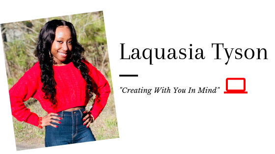

Hi,  I'm here to talk about introversion, and share my insights on how I think it's viewed by extroverts. All based on my experiences. 

I'm sure we all know introverts, I'm sure we all know extroverts. For me, I've ALWAYS been SHY, reserved  and the "keep to myself" type of person….100% INTROVERT. When I say ALWAYS, I mean ALWAYS. From Preschool up to now, Grad School. People will tell me today, they thought college would have broken me out of it. Maybe for some, but not for me, and others. 

The reality is, being an introvert isn't something I'm "trying" to break from. It's who I am! I have accepted this personality. Why should I want to be an extrovert? Why should I want to change the person I am? Why should I want to become someone I'm not?

I just love it when an extrovert says, "I can break you out your shell." Do you know how many times I've heard that? Well, what do we have here, I'm still the same introvert. You can't break me out my shell. You can't assume because I'm quiet, I'm weak. You can't assume because I'm quiet, I don't understand when you're making your slick comments towards me. Well actually, I'll take that back. You are welcomed to assume anything about me as you please, but just know it's what you see vs what I know. 

Never will I judge you because of your personality. However, not all people will do the same.

Why do extroverts feel a certain way towards introverts? Why can't I be an introvert without you harassing me because of it?

Introverts 
🔷Have you ever had to deal with people constantly telling you you need to speak up / talk more?
🔷Do you ever feel like people treat your personality as a threat?
🔷Do you ever wish people would just accept you for who you are?

---

My favorite question to hear people ask me is, "Why are you so quiet?"  Like what if I ask you, "Why are you so loud?" Being loud and talkative doesn't  make you any better, smarter, or wiser than someone who is quiet. I must say being an introvert has allowed me to see myself different and others as well. I understand that everyone is different but others just don't get it. 

Yes, I'm an introvert. I'm also a dedicated and hard working professional who gets the job done. I refuse to change who I am. This is me! I can be successful in life, I WILL be successful in life as an introvert. I'm going to continue to show you that. Never, will I allow how others view my personality to make me feel down about myself.
 
I think introverts are looked down on by extroverts only because extroverts don't understand introverts. They don't want to understand us, so instead they just think of us as being less than them. As if, being an extrovert is what God has intended us all to be.

People want to think of people like myself as sneaky, weird, "up to something". When the only thing I'm up to is, minding my business, speaking when needed and doing what's needed. Simple as that. 

I've learned to embrace my introversion.

I just want to be the VOICE for all introverts who go through what I go through. You are not alone! Please reach out to me if you're wanting to discuss how you can feel better about yourself . Whatever you do, don't allow extroverts to make you feel like you have to be one of them. You must embrace who you truly are and if that means being an introvert, so what. You are somebody! Your life matters! Continue to do what makes you happy and never worry about how those looking on the outside view you. Their opinion doesn't matter, it's how you view yourself.

